# AutoPubX: Intelligent Book Creation Pipeline

# 📘 AutoPubX: Intelligent Book Creation Pipeline

An intelligent and automated pipeline to extract book chapters from the web, rewrite ("spin") them using AI, enable iterative human input, and store final outputs with version control and intelligent retrieval.

---

## 🧭 Table of Contents

- [🔍 Introduction](#-introduction)  
- [✨ Features](#-features)  
- [🧰 Tech Stack](#-tech-stack)  
- [🏗️ Architecture](#-architecture)  
- [⚙️ Installation](#-installation)  
- [🛠️ Configuration](#-configuration)  
- [🚀 Usage](#-usage)  
- [📚 Workflow Example](#-workflow-example)  
- [📦 Dependencies](#-dependencies)  
- [👥 Contributors](#-contributors)  
- [🪪 License](#-license)  
- [🐞 Troubleshooting](#-troubleshooting)

---

## 🔍 Introduction

This project enables the automated transformation of public domain literature into AI-enhanced rewritten versions. Starting with chapter scraping and screenshots, it flows through AI-assisted writing and reviewing, facilitates human feedback loops, and stores version-controlled outputs using ChromaDB with intelligent search.

---

## ✨ Features

- **Web Scraping**: Extract chapter content and take full-page screenshots from a URL using Playwright.
- **AI Spinning & Reviewing**: Rewrite chapters with a large language model (LLM) and conduct AI-based peer reviews.
- **Human-in-the-Loop Workflow**: Supports multi-stage human editing before content is finalized.
- **Agent-Orchestrated Pipeline**: Inter-agent communication and decision flows managed via a custom agentic API.
- **Version Control & Retrieval**: Store and retrieve different versions using ChromaDB and reinforcement-learning (RL) based semantic search.

---

## 🧰 Tech Stack

| Tool/Library | Description | Logo |
|--------------|-------------|------|
| **[Gemini API](https://ai.google.dev/)** | Used for AI-driven chapter rewriting and reviewing |  |
| **[Playwright](https://playwright.dev/)** | Automates web scraping and screenshots |  |
| **[Hugging Face Transformers](https://huggingface.co/transformers/)** | Optional models for additional NLP tasks |  |
| **[Python](https://www.python.org/)** | Core development language |  |
| **[ChromaDB](https://www.trychroma.com/)** | Vector database for storing and retrieving AI-enhanced content |  |

---

## 🏗️ Architecture

```text
[ Scraper + Screenshot ]
           ↓
      [ AI Writer ]
           ↓
   [ Human Writer Pass ]
           ↓
     [ AI Reviewer ]
           ↓
   [ Human Reviewer Pass ]
           ↓
     [ Editor Finalizes ]
           ↓
[ ChromaDB + RL Search Integration ]
```

---

## 📚 Workflow Example

<div align="center">

### 🔄 **Step-by-Step Process Flow**

</div>

| Step | 🎯 Action | 📋 Description | ⏱️ Status |
|------|-----------|----------------|-----------|
| **1** | 🕷️ **Scrape the content** | Extract chapter text and capture screenshots from web sources | ✅ Ready |
| **2** | 🤖 **AI rewrites the chapter** | Transform content using advanced language models | 🔄 Processing |
| **3** | ✍️ **Writer reviews output** | Human writer enhances and refines AI-generated content | 👁️ Review |
| **4** | 🔍 **AI Reviewer analyzes and suggests** | Automated quality assessment and improvement recommendations | 📊 Analysis |
| **5** | 👤 **Human Reviewer edits and confirms** | Final human validation and editorial changes | ✏️ Editing |
| **6** | ✅ **Final Editor approves** | Ultimate approval and quality assurance | 🎉 Complete |
| **7** | 💾 **Store in ChromaDB** | Version-controlled storage in vector database | 📚 Archived |
| **8** | 🔎 **Retrieve via smart RL-based query** | Intelligent search and retrieval using reinforcement learning | 🧠 Smart Search |

```mermaid
graph TD
    A[🕷️ Web Scraping] --> B[🤖 AI Rewriting]
    B --> C[✍️ Human Writer Review]
    C --> D[🔍 AI Analysis]
    D --> E[👤 Human Final Review]
    E --> F[✅ Editorial Approval]
    F --> G[💾 ChromaDB Storage]
    G --> H[🔎 RL-Based Retrieval]
    
    style A fill:#e1f5fe,stroke:#0277bd,stroke-width:2px
    style B fill:#f3e5f5,stroke:#7b1fa2,stroke-width:2px
    style C fill:#e8f5e8,stroke:#2e7d32,stroke-width:2px
    style D fill:#fff3e0,stroke:#ef6c00,stroke-width:2px
    style E fill:#fce4ec,stroke:#c2185b,stroke-width:2px
    style F fill:#e0f2f1,stroke:#00695c,stroke-width:2px
    style G fill:#f1f8e9,stroke:#558b2f,stroke-width:2px
    style H fill:#ede7f6,stroke:#5e35b1,stroke-width:2px
```

<div align="center">



</div>

---

## 📦 Dependencies

<div align="center">

### 🛠️ **Required Components & Technologies**

</div>

<table align="center">
<tr>
<td align="center" width="50%">

#### 🐍 **Core Requirements**
---


**Essential Foundation**
- Minimum Python 3.10 for optimal performance
- Advanced async/await support
- Modern type hints compatibility

</td>
<td align="center" width="50%">

#### 🎭 **Web Automation**
---


**Browser Automation**
- Cross-browser screenshot capability
- Robust web scraping engine
- Headless operation support

</td>
</tr>
<tr>
<td align="center">

#### 🗃️ **Vector Database**
---


**Intelligent Storage**
- Vector-based content storage
- Semantic similarity search
- Version control integration

</td>
<td align="center">

#### 🧠 **AI Integration**
---

<br/>


**Language Models**
- Advanced text generation
- Content analysis & review
- Multi-model support

</td>
</tr>
<tr>
<td align="center">

#### 🤗 **ML Framework (Optional)**
---


**Extended NLP**
- Additional model options
- Custom transformer support
- Fine-tuning capabilities

</td>
<td align="center">

#### 🔍 **Smart Search**
---


**Reinforcement Learning**
- Intelligent query optimization
- Adaptive search algorithms
- Performance learning

</td>
</tr>
<tr>
<td colspan="2" align="center">

#### 📚 **Additional Libraries**
---
<div>


</div>

**Supporting Utilities** • Environment management • CLI framework • HTTP client • Async operations • Data serialization

</td>
</tr>
</table>

---

## 👥 Contributors

<div align="center">

### 🌟 **Project Team**

<table>
<tr>
<td align="center">

<br />
<sub><b>🗡️ Rohan Sharma</b></sub>
<br />
<sub>Creator & Developer</sub>
<br />
<a href="https://github.com/KnightofInd" title="GitHub">🔗</a>
</td>
</tr>
</table>

<div>


</div>

---


</div>

